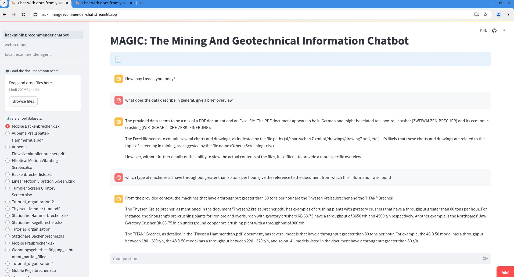

# Local LLM powered Design Recommendation Chatbot and Scraper 

HackMining Hackathon Challenge 2024. POC for locally hosted recommender chatbot and information scraper.

## Overview

Live Demo App of the recommendation system and smart scraper. LLM + RAG based chatbot.

Demo Link: [hackmining recommender chat streamlit live demo app](https://hackmining-recommender-chat.streamlit.app/) 

LlamaIndex for the RAG (Retrieval Augmented Generation) embedding vector database. 

Local LLM (Ollama, Llama3 - not developed yet) or OpenAI API (this POC implementation). 

Streamlit for custom chatbot and scraper user interface.

### Recommender chatbot UI
Add your own technical documents (pdfs, excels, csv, doc, html) using the chatbot user interface.
App is already loaded with technical documents from the `data` folder. Modify the files or add new documents in the folder to directly load it in the chatbot.



### Smart scraper

LLM powered smart scraper. Built using [ScrapeGraphAI](https://github.com/VinciGit00/Scrapegraph-ai).

Give it the link to a website. Ask it to generate the relevant information that needs to be extracted from the webpage (z.B any product info and listing page, company information, technical reports page, etc)


## Setup to run locally


### Setup virtual environement

0. python virtual env setup: 
    - [venv — Creation of virtual environments docs](https://docs.python.org/3/library/venv.html)
    - [venv setup guide](https://www.freecodecamp.org/news/how-to-setup-virtual-environments-in-python/)

1. create and activate virtual env
    ```
    python3 -m venv local_llm_chat
    source env/bin/activate
    ```

### App setup
2. clone repo
    ```
    git clone https://github.com/yojuna/local_llm_chat.git
    cd local_llm_chat
    ```

3. install requirements
    ```
    pip install -r requirements.txt
    ```

4. Set OpenAI API key in secrets.toml configuration file
    ```
    mkdir -p .streamlit
    cp project.toml.example ./streamlit/secrets.toml
    ```
    Replace the dummy `openai_key="sk-XXX ..."` variable with your API key

### Running the app 


```shell
$ streamlit run hackmining_recommender_chatbot.py
```

Follow the locally hosted web links generated to open the app in your browser.

### Alternative: Running directly with Docker

Instead of the manual install steps above, run directly via docker.

This project includes a `Dockerfile` as well as `docker-compose.yml` to run the app in Docker container. In order to optimise the Docker Image is optimised for size and building time with cache techniques.

Build the docker image
```
docker build --target=runtime . -t local_llm_chat
```

Run the docker container directly

```
docker run -d --name local_llm_chat -p 8051:8051 local_llm_chat
```

2. Run the docker container using docker-compose (Recommended)

```
docker-compose up
```

##  useful resources

### colab notebooks with chatbot experiments

draft jupyter colab notebooks 
- [Multimodal documents RAG LLM with vision](https://colab.research.google.com/drive/1yH96j1WbvyywP_vFV9zEhq8jbAiaD0Au?usp=sharing)
- [Multiple document recommender chatbot](https://colab.research.google.com/drive/1U7G4fRXWMSyu67DoSDF6YSG6odvshJ4B?usp=sharing)

- [Multiple documents agents based rag](https://colab.research.google.com/drive/1QENAK2QsLn01qAjfSWvByfIevrTgJVNE?usp=sharing)

### LlamaIndex

- LlamaIndex official docs
    - [examples](https://docs.llamaindex.ai/en/stable/examples/) 
    - use cases - [Question-Answering (RAG)](https://docs.llamaindex.ai/en/stable/use_cases/q_and_a/)

- [Multi-Document Agents](https://docs.llamaindex.ai/en/stable/examples/agent/multi_document_agents/)
- [Simple Directory Reader data connector](https://docs.llamaindex.ai/en/stable/examples/data_connectors/simple_directory_reader/)
- [Pandas query engine](https://docs.llamaindex.ai/en/stable/examples/query_engine/pandas_query_engine/)

- Llama3 cookbook; [example](https://docs.llamaindex.ai/en/stable/examples/cookbooks/llama3_cookbook/)

### streamlit

- [build an llm powered chatbot with streamlit](https://blog.streamlit.io/how-to-build-an-llm-powered-chatbot-with-streamlit/)
- [llm app examples with code](https://streamlit.io/gallery?category=llms)
- [locall llm with pdfs streamlit app tutorial](https://medium.com/@stefnestor/streamlit-local-llm-pdfs-0a7243883a12)

